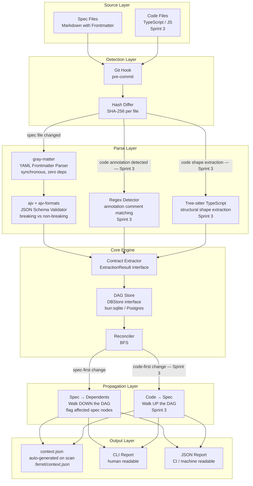
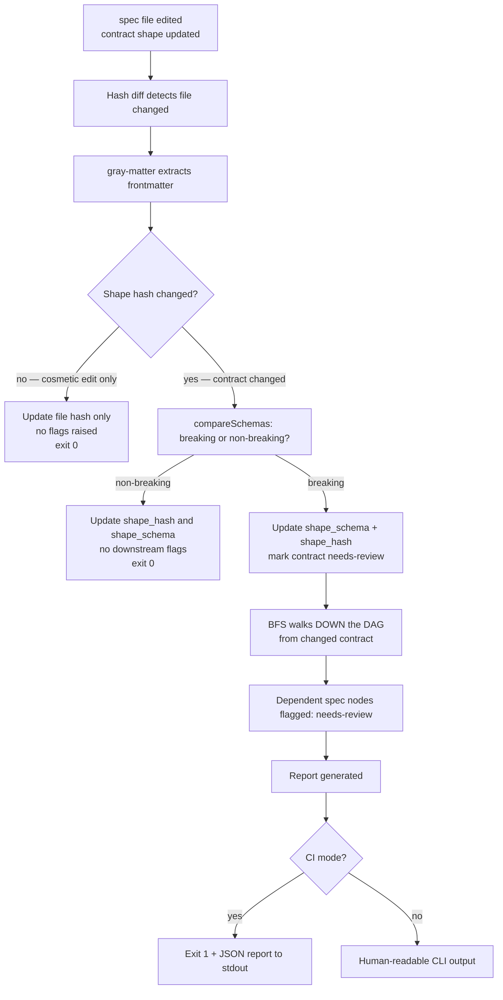
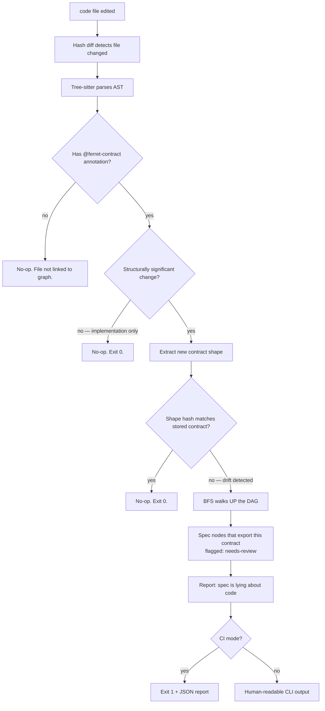

# SpecFerret V2 — Architecture

Generated: March 2026
Status: Sprint 1 complete. Approved for Sprint 2.

Runtime: Bun 1.0+
Default local storage: `bun:sqlite` behind the `DBStore` interface.
Test runner: `bun test`
Language: TypeScript strict mode

---

## System Overview



---

## The Data Model

Every file SpecFerret tracks is a `ferret_node`.
The `type` field distinguishes spec nodes from code nodes.
The rest of the schema is identical across both types.

```mermaid
erDiagram
    ferret_nodes {
        string id PK
        string file_path
        string hash
        string status "stable | needs-review | roadmap | blocked"
        datetime updated_at
    }

    ferret_contracts {
        string id PK
        string node_id FK
        string type "api | table | type | flow | event | config"
        string shape_schema "JSON Schema object as JSON string"
        string shape_hash "SHA-256 of key-sorted schema"
        string status "stable | needs-review | roadmap"
    }

    ferret_dependencies {
        string id PK
        string source_node_id FK
        string target_contract_id FK
    }

    ferret_nodes ||--o{ ferret_contracts : "exports"
    ferret_nodes ||--o{ ferret_dependencies : "source"
    ferret_contracts ||--o{ ferret_dependencies : "target"
```



---

## The DAG Model

Spec nodes and code nodes live in the same graph.
Edges are always contract-mediated — a node depends on a contract,
not directly on another node.

Today: spec nodes only. Code nodes arrive in Sprint 3.

```mermaid
graph LR
    subgraph Spec["Spec Nodes — Sprint 1"]
        S1[auth.md<br/>exports: auth.jwt]
        S2[search.md<br/>exports: api.GET/search<br/>imports: auth.jwt]
        S3[document.md<br/>exports: tables.document]
    end

    subgraph Code["Code Nodes — Sprint 3"]
        C1[auth.ts<br/>@ferret-contract: auth.jwt]
        C2[search.handler.ts<br/>@ferret-contract: api.GET/search]
        C3[schema.ts<br/>@ferret-contract: tables.document]
    end

    S1 -->|auth.jwt| S2
    S3 -->|tables.document| S2
    S1 -->|auth.jwt| C1
    S2 -->|api.GET/search| C2
    S3 -->|tables.document| C3
```

---

## Drift Direction 1: Spec Changes → Dependents Flagged

**Sprint 1 — Built and shipping.**

A spec file is edited. The contract shape inside it changes.
The source node stays stable. Its dependents get flagged.



---

## Drift Direction 2: Code Changes → Spec Flagged

**Sprint 3 — Not yet built.**

A code file is edited. Tree-sitter checks if the change is structurally significant.
Only signature-level changes propagate. Implementation changes are silent.



---

## Layer Responsibilities

Strict separation. No layer reaches into another layer's domain. Ever.

| Layer | Responsibility | Does NOT do |
|---|---|---|
| **Store** | Insert, update, query, delete. Parameterised SQL only. | Business logic, graph traversal, parsing |
| **Extractor** | Turn a file into an `ExtractionResult`. | Talk to store, know about graph |
| **Validator** | Validate JSON Schema subset. Classify breaking vs non-breaking. | Parse files, I/O, side effects |
| **Reconciler** | BFS traversal, flag dirty nodes, return report. | Parse files, format output |
| **Context** | Write `.ferret/context.json` after every scan. | Anything else |
| **CLI** | Read config, call core, print result, exit. | Business logic, parsing, traversal |

**CLI command file maximum: 50 lines. If a command file exceeds this, logic is in the wrong layer.**

---

## The ExtractionResult Interface

Every parser — gray-matter today, Tree-sitter in Sprint 3 —
returns this exact shape. The rest of the system cannot tell them apart.

```typescript
interface ExtractionResult {
  filePath: string;
  fileType: 'spec' | 'code';
  contracts: Array<{
    id: string;          // e.g. "api.GET/search"
    type: string;        // e.g. "api"
    shape: object;       // JSON Schema object — SpecFerret supported subset
    shape_hash: string;  // SHA-256 of key-sorted schema
    imports: string[];   // e.g. ["auth.jwt", "tables.document"]
  }>;
  extractedBy: 'gray-matter' | 'tree-sitter';
  extractedAt: number;   // unix ms
  warning?: 'no-frontmatter';
}
```

---

## Technology Decisions — Final

These are not open for discussion or reconsideration.

| Job | Tool | Reason |
|---|---|---|
| Runtime | Bun 1.0+ | Performance, native SQLite, TypeScript native, Claude Code alignment |
| Spec frontmatter parsing | `gray-matter` | Synchronous, proven, zero deps |
| JSON Schema validation | `ajv` + `ajv-formats` | 50M weekly downloads. Proven. |
| Schema hashing | `node:crypto` SHA-256 | Built-in, deterministic, fast |
| Storage — default | `bun:sqlite` | Built-in to Bun, synchronous, zero deps |
| Storage — roadmap | Postgres via `DBStore` interface | Sprint 2 |
| Annotation detection | Regex | Sprint 1. `@ferret-contract:` is a predictable pattern. No parser needed. |
| Code shape extraction | Tree-sitter TypeScript | Sprint 1. Pulled forward from Sprint 3 — structural extraction without annotations is the primary use-case. |
| Test runner | `bun test` | Native to runtime, fast, no config |

**Do not use WASM. Do not add LLMs to the default path. Ever.**

---

## Sprint Boundaries

```
Sprint 1 (complete)
  ferret init       — SQLite, scaffold files, pre-commit hook opt-in
  ferret scan       — gray-matter extraction, breaking/non-breaking classification
  ferret lint       — scan + reconcile, Boris output format, --ci JSON mode
  context.json      — auto-generated on every scan
  Performance gate  — ferret lint under 500ms on clean project

Sprint 2 (roadmap)
  Postgres store implementation
  SQLite → Postgres migration
  ferret upgrade command

Sprint 3 (roadmap)
  Code node scanning — upward BFS drift detection
  ferret place, ferret status, ferret graph commands
  Full import integrity enforcement

Sprint 4 (roadmap)
  ferret audit — bidirectional drift report
  ferret review — interactive resolution flow
  Deleted contract lifecycle handling
  Additional language grammars

V3 (Sebastian's vision)
  Rust transpiler — built on the JSON Schema foundation
  Full JSON Schema support ($ref, allOf, composition)
```

---

*© Laser Unicorn — MIT License*